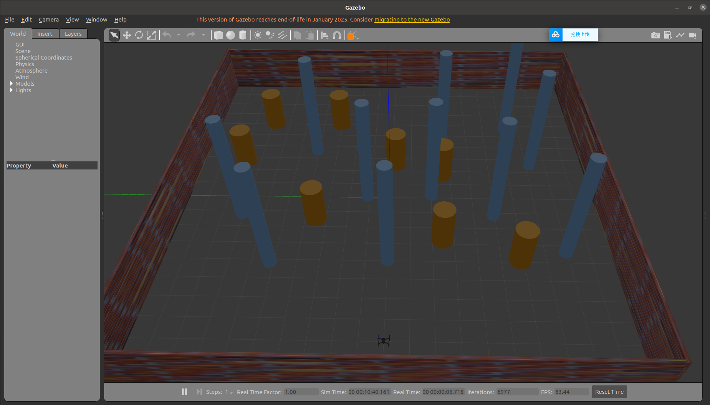

# AAE5306 - Guidance and Navigation
## PX4 / MAVROS Environment Setup Guide
This guide walks you through installing the PX4 Autopilot toolchain, configuring MAVROS, and running simulation demos that showcase the Iris drone with additional sensors (Velodyne LiDAR, Intel RealSense D435i, GNSS, and IMU). A pre-packaged archive with extra models is available in `PX4-Autopilot.zip`; downloading and expanding it is recommended before you begin.

## Repository Contents

| Item | Purpose |
| --- | --- |
| `PX4-Autopilot.zip` | Preconfigured PX4 tree containing custom sensor models. |
| `README.md` | This setup and troubleshooting guide. |

> **Tip:** If you have successfully download and build the PX4-Autopilot before. You just need to replace the `launch` folder and `Tools` folder in the new PX4-Autopilot package with the old PX4-Autopilot package `launch` folder and `Tools` folder

## 1. Install PX4 Dependencies and Build Tools

The PX4 team maintains convenience scripts that install compilers, Gazebo, JMAVSim, and SITL dependencies. Either extract the provided `PX4-Autopilot.zip` or clone the upstream repository before running the script.

```bash
# Recommended: use the provided archive so you get the custom models(LiDAR Camera IMU GNSS).
https://drive.google.com/file/d/1WIy_1Ke3O_kwL73GAojkY0P9fr-JuW7u/view?usp=drive_link

#unzip the .zip
unzip PX4-Autopilot.zip

# Install PX4 build dependencies (Gazebo, JMAVSim, toolchains, etc.).
bash ./PX4-Autopilot/Tools/setup/ubuntu.sh

# Reboot is optional but helps ensure new kernel modules and udev rules are active.
sudo reboot

# After the reboot, build and launch the JMAVSim SITL target.
cd PX4-Autopilot
make px4_sitl jmavsim  # JMAVSim simulation
```

When the JMAVSim window appears the SITL environment is ready:


To launch the Gazebo variant:

```bash
# Build and launch Gazebo SITL
make px4_sitl gazebo
```

Expect Gazebo to open with the Iris vehicle. Occasional red console warnings are normal—ignore them unless the simulator fails to load completely.


## 2. Install MAVROS

MAVROS bridges MAVLink autopilots with ROS. Install it from apt along with the GeographicLib datasets required for geolocation plugins.

```bash
# Install MAVROS and the extras package for common plugins.
sudo apt install ros-noetic-mavros ros-noetic-mavros-extras

# Fetch and run the helper script that installs GeographicLib datasets.
wget https://raw.githubusercontent.com/mavlink/mavros/master/mavros/scripts/install_geographiclib_datasets.sh
chmod +x install_geographiclib_datasets.sh
sudo ./install_geographiclib_datasets.sh

# Refresh package indexes and reboot so ROS and PX4 environment variables are sourced cleanly.
sudo apt update
sudo reboot

# After the reboot, verify MAVROS can launch alongside PX4 SITL.
roslaunch px4 mavros_posix_sitl.launch
```

If the Gazebo interface resembles the `make px4_sitl gazebo` run, MAVROS is talking to PX4 correctly.

## 3. Simulation Demonstrations

With PX4 SITL and MAVROS working, use the provided launch files for quick-start demos that include the Intel RealSense D435i and Velodyne LiDAR payloads.

```bash
# Launch Gazebo with the Iris + D435i + GNSS/IMU payload.
roslaunch px4 fast_test.launch

# Launch Gazebo with the Iris + Velodyne LiDAR + D435i + GNSS/IMU payload.
roslaunch px4 fast_test_lidar.launch
```

Before launching the LiDAR variant, install the Velodyne ROS drivers and Gazebo plugins:

```bash
sudo apt install ros-noetic-velodyne \
				ros-noetic-velodyne-gazebo-plugins \
				ros-noetic-velodyne-driver
```

Once the world finishes loading you should see the augmented Iris drone and sensor payloads:



## 4. Troubleshooting

### ROS Cannot Find `fast_test.launch` or `px4`

```
RLException: [fast_test.launch] is neither a launch file in package [px4] nor is [px4] a launch file name
```

or

```
Resource not found: The following package was not found in : mavlink_sitl_gazebo
ROS path [0]=/opt/ros/noetic/share/ros
ROS path [1]=/home/mobot/catkin_ws/src
ROS path [2]=/home/mobot/vision_ws/src ROS path
```

These errors usually mean ROS does not know where the PX4 workspace lives. Add the PX4 environment setup scripts and paths to your shell configuration:

```bash
# Append to ~/.bashrc (press Ctrl+H in your home directory to show hidden files).
source ~/PX4-Autopilot/Tools/setup_gazebo.bash ~/PX4-Autopilot/ ~/PX4-Autopilot/build/px4_sitl_default
export ROS_PACKAGE_PATH=$ROS_PACKAGE_PATH:~/PX4-Autopilot
export ROS_PACKAGE_PATH=$ROS_PACKAGE_PATH:~/PX4-Autopilot/Tools/sitl_gazebo
```

Reload the file (`source ~/.bashrc`) or `open a new terminal`, then retry the `roslaunch` command.

### Checking Topics Inside the Simulation

Once the Gazebo world is running you can explore published topics. The list below highlights useful telemetry streams:

> **Tip:** For the images, you can directly run the command `rqt_image_view`, you will see the different images

```bash
# Enumerate all available topics.
rostopic list

# Representative telemetry topics.
rostopic echo /mavros/imu/data                    # Drone IMU
rostopic echo /iris_3Dlidar/camera_imu            # Camera IMU
rostopic echo /iris_3Dlidar/realsense/depth_camera/color/image_raw #RGB Camera
rostopic echo /iris_3Dlidar/realsense/depth_camera/depth/image_raw #Depth Camera
rostopic echo /iris_3Dlidar/stereo_camera/left/image_raw #Left Camera
rostopic echo /iris_3Dlidar/stereo_camera/right/image_raw #Right Camera
rostopic echo /mavros/local_position/odom         # Local odometry ground truth of the drone
rostopic echo /mavros/global_position/global      # Global position ground truth of the drone
rostopic echo /velodyne_points                    # Velodyne point cloud
```
